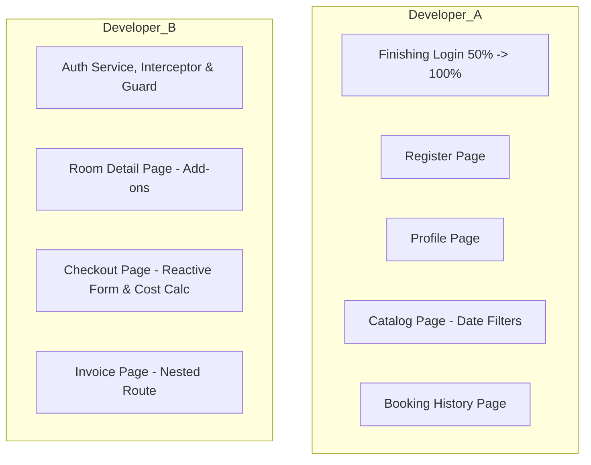

# DOKUMEN SPESIFIKASI PEMBAGIAN KERJA FRONTEND (FE)
## PROYEK: STAYHUB LODGING RESERVATION SYSTEM

Dokumen ini mendefinisikan pembagian tugas pengembangan Frontend (FE) StayHub secara adil, berimbang, dan modular untuk **2 Orang Developer (Developer A & Developer B)**. 

---

## 1. STATUS PROYEK SAAT INI
*   **Backend (BE):** 100% Selesai (Semua API endpoint sudah siap digunakan).
*   **Frontend (FE) - Halaman Login:** 50% Selesai (UI dasar sudah ada, memerlukan penyelesaian integrasi API, state token, dan navigasi redirect).

---

## 2. STRUKTUR UTAMA & PANDUAN VISUAL (SHARED THEME)
Untuk memastikan visual aplikasi tetap konsisten dan tidak kontras antara hasil kerja Developer A dan Developer B, seluruh tim wajib menggunakan konfigurasi Tailwind CSS berikut:

### **Konfigurasi Warna (`tailwind.config.js`):**
```javascript
theme: {
  extend: {
    colors: {
      primary: '#0F766E',      // Emerald Green (Warna Utama & Highlight)
      primaryHover: '#0D9488', // Hover State
      secondary: '#D97706',    // Amber/Gold (Diskon, Rating, & Promo)
      background: '#F8FAFC',   // Off-White / Slate 50 (Latar Halaman)
      surface: '#FFFFFF',      // Putih Bersih (Card & Modal)
      textDark: '#1E293B',     // Slate 800 (Teks Utama)
      textMuted: '#64748B',    // Slate 500 (Deskripsi/Teks Redup)
      border: '#E2E8F0',       // Slate 200 (Garis Pembatas & Border Form)
    }
  }
}
```

### **Standar Desain Komponen:**
*   **Radius Sudut:** Gunakan `rounded-lg` (8px) untuk tombol/input dan `rounded-xl` (12px) untuk kartu kontainer.
*   **Tombol Utama:** `bg-primary hover:bg-primaryHover text-white font-medium px-4 py-2 rounded-lg transition-colors`
*   **Input Form:** `w-full px-3 py-2 border border-border rounded-lg focus:outline-none focus:ring-2 focus:ring-primary focus:border-transparent text-textDark bg-white`

---

## 3. DISTRIBUSI PENGERJAAN HALAMAN (PAGE-BY-PAGE)



### **DEVELOPER A**
*Fokus pada Halaman Katalog, Manajemen Akun (Auth & Profile), dan Riwayat Booking.*

| No | Modul / Halaman | Deskripsi Kerja & Alur Fitur | API Backend Terkait |
|:--:|:----------------|:-----------------------------|:--------------------|
| **1** | **Finishing Login** (50% $\rightarrow$ 100%) | Menyelesaikan sisa pengerjaan halaman login, menghubungkan form ke `AuthService` untuk menyimpan JWT token, dan menangani error response. | `POST /api/auth/login` |
| **2** | **Halaman Register** (`/register`) | Membuat form registrasi akun tamu baru lengkap dengan validasi standard frontend (format email, panjang password). | `POST /api/auth/register` |
| **3** | **Halaman Profil** (`/profile`) | Membuat form edit data diri (Nama & Telepon) dan menyediakan tombol untuk menonaktifkan akun (Soft Delete). | `PUT /api/users/profile`<br>`DELETE /api/users/profile` |
| **4** | **Halaman Katalog Kamar** (`/catalog` atau `/`) | Halaman beranda yang menampilkan daftar tipe kamar. Wajib menyediakan form input **Filter Tanggal Check-in & Check-out** untuk mengecek ketersediaan kamar. | `GET /api/room-types` (dengan filter query params) |
| **5** | **Halaman Riwayat Booking** (`/bookings`) | Menampilkan daftar seluruh reservasi yang pernah dibuat oleh user. Menyediakan tombol **Batalkan Booking** dengan konfirmasi dialog popup. | `GET /api/reservations/my-history`<br>`PATCH /api/reservations/{id}/cancel` |

---

### **DEVELOPER B**
*Fokus pada Infrastruktur Keamanan Global, Halaman Transaksi Utama (Checkout), dan Halaman Detail.*

| No | Modul / Halaman | Deskripsi Kerja & Alur Fitur | API Backend Terkait |
|:--:|:----------------|:-----------------------------|:--------------------|
| **1** | **Infrastruktur Global (Shared)** | 1. **Auth Service**: Mengelola token di localStorage.<br>2. **Auth Interceptor**: Menyisipkan token `Bearer <token>` ke header HTTP secara otomatis.<br>3. **Auth Guard**: Melindungi rute internal dari user non-login. | *(Client-side state)* |
| **2** | **Halaman Detail Kamar** (`/catalog/:id`) | Menampilkan galeri foto, spesifikasi detail tipe kamar, serta daftar layanan tambahan (**Extra Services / Add-ons**) yang aktif dalam bentuk checkbox atau counter kuantitas. | `GET /api/room-types/{id}`<br>`GET /api/extra-services` |
| **3** | **Halaman Form Booking / Checkout** (`/checkout`) | **[Fitur Kompleks - Ketentuan #6]**<br>Form pemesanan menggunakan **Reactive Forms (FormBuilder)** dengan **Custom Validator** (misal: Tanggal check-out harus setelah tanggal check-in).<br>Menghitung kalkulasi harga real-time di FE (diskon inap berjenjang, total biaya add-ons, biaya late check-out, diskon promo code) sebelum menekan tombol "Bayar Sekarang". | `POST /api/promotions/validate`<br>`POST /api/reservations` |
| **4** | **Halaman Invoice** (`/bookings/:id`) | **[Ketentuan #7 - Nested Route]**<br>Menampilkan rangkuman invoice pembayaran setelah pemesanan berhasil atau saat melihat detail riwayat. Menggunakan rute bersarang (**Nested/Child Route** via `<router-outlet>`) untuk memisahkan Tab "Rincian Transaksi" dan Tab "Fasilitas Kamar" tanpa berpindah halaman. | `GET /api/reservations/{id}` |

---

## 4. MATRIKS KOMPLEKSITAS TUGAS (CHECKLIST PEMBAGIAN KERJA)

| Indikator | Developer A | Developer B | Catatan Keseimbangan |
|:---|:---:|:---:|:---|
| **Jumlah Halaman** | 4,5 Halaman (1 Halaman tinggal finishing) | 3 Halaman | Developer A memegang jumlah halaman lebih banyak namun berukuran kecil-menengah. |
| **Kompleksitas Logika** | Sedang (Filter ketersediaan tanggal & query routing) | Sangat Tinggi (Perhitungan rumus bisnis transaksi di FE & validasi promo) | Beban kalkulasi dipegang Developer B. |
| **Persyaratan Khusus PRD** | - | 1. Reactive Forms + Custom Validator<br>2. HTTP Interceptor & Auth Guard<br>3. Nested/Child Routing | Developer B memegang semua pilar arsitektur kompleks Angular untuk proyek ini. |

---

## 5. REKOMENDASI WORKFLOW GABUNGAN (INTEGRASI)
1. **Developer B** sebaiknya membuat `AuthService`, `AuthInterceptor`, dan `AuthGuard` terlebih dahulu di hari pertama agar bisa langsung digunakan oleh **Developer A** untuk mengamankan halaman profil dan riwayat booking.
2. Saat pengerjaan **Katalog** (Developer A) dan **Detail/Checkout** (Developer B), gunakan state sharing (misalnya query parameters router atau shared service) untuk mengirim data tanggal *check-in/check-out* yang dipilih di halaman katalog langsung ke halaman detail dan checkout.
